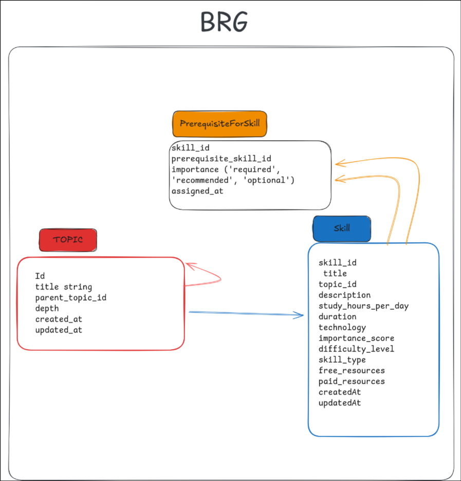
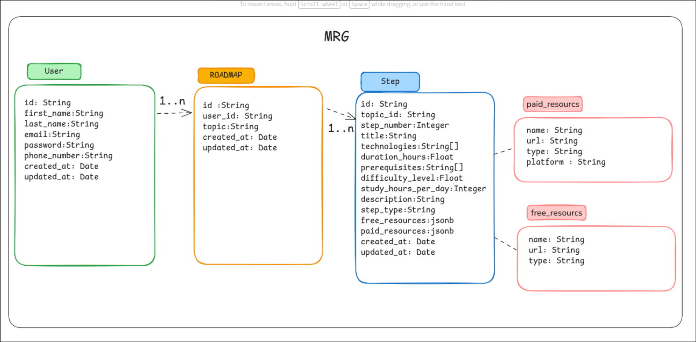

# Database Design

## 1. DB general architecture 
### 1.1 Two-Tier Storage Architecture
**Separation Rationale:**

1. ***BRG (Base Roadmap Group):***
    - Acts as a knowledge repository - contains validated, ``Topic`` and ``skill``
2. ***MRG (Main Roadmap Group):*** 
    - Acts as user interaction layer - contains personalized  roadmap  derivative  from ``Topic`` and ``skill``
---

## 2.BRG

### Models

#### 1. Skill
- **id**: String
- **topic_id**: String
- **title**: String
- **description**: String
- **duration**: Int
- **score**: Float
- **study_hours_per_day**: Int
- **skill_type**: SkillTypeEnum / default(REQUIRED)
- **technologies**: String[]
- **free_resources**: Json?
- **paid_resources**: Json?
- **created_at**: DateTime / default(now())
- **updated_at**: DateTime
- **Indexes**:
  - topic_id
- **Score Function**:
    - score_func = importance_score *1/sqrt((2+prerequisite_number)) *1/(4+step_number)
---

#### 2. PrerequisiteForSkill
- **skill_id**: String
- **prerequisite_id**: String
- **importance**: SkillTypeEnum / default(REQUIRED)
- **assigned_at**: DateTime / default(now())
- **Relations**:
  - skill: Skill (relation: "SkillPrerequisites", fields: [skill_id], references: [id])
  - prerequisite: Skill (relation: "PrerequisiteSkill", fields: [prerequisite_id], references: [id])
- **Primary Key**: [skill_id, prerequisite_id]
- **Indexes**:
  - prerequisite_id

---

#### 3. Topic
- **id**: String / @id @default(cuid())
- **title**: String
- **depth**: Int
- **parent_topic_id**: String?
- **created_at**: DateTime / default(now())
- **updated_at**: DateTime / @updatedAt
- **Relations**:
  - parent_topic: Topic? (relation: "TopicHierarchy", fields: [parent_topic_id], references: [id])
  - child_topics: Topic[] (relation: "TopicHierarchy")
  - skills: Skill[]
- **Indexes**:
  - parent_topic_id
  - depth
  - title

---

#### Enums

##### SkillTypeEnum
- **REQUIRED**
- **RECOMMENDED**
- **OPTIONAL**

---

#### Relationships Overview

##### Skill Relationships
- Belongs to one Topic (via topic_id)
- Can have multiple prerequisites (PrerequisiteForSkill)
- Can be a prerequisite for other skills (PrerequisiteForSkill)

##### Topic Relationships
- Self-referential hierarchy (parent-child relationship)
- Contains multiple Skills
- Forms a tree structure through parent_topic_id

##### PrerequisiteForSkill Relationships
- Junction table connecting Skills to their prerequisites
- Many-to-many relationship between Skills
- Tracks importance level of each prerequisite

---

### BRG diagram

---
## 2.MRG
### Models

#### Step
- **id**: String / @id @default(cuid())
- **roadmap_id**: String
- **step_number**: Int
- **title**: String
- **technologies**: String[]
- **duration_hours**: Float
- **prerequisites**: String[]
- **difficulty_level**: Float
- **study_hours_per_day**: Int
- **description**: String
- **step_type**: SkillTypeEnum / default(REQUIRED)
- **free_resources**: Json?
- **paid_resources**: Json?
- **created_at**: DateTime / default(now())
- **updated_at**: DateTime / @updatedAt
- **Relations**:
  - roadmap: Roadmap (relation: "RoadmapSkills", fields: [roadmap_id], references: [id])
- **Indexes**:
  - roadmap_id
  - step_number
  - [roadmap_id, step_number]

---

####  Roadmap
- **id**: String / @id @default(cuid())
- **user_id**: String
- **topic**: String
- **created_at**: DateTime / default(now())
- **updated_at**: DateTime / @updatedAt
- **Relations**:
  - user: User (relation: "UserRoadmap", fields: [user_id], references: [id])
  - steps: Step[] (relation: "RoadmapSkills")
- **Indexes**:
  - user_id
  - topic

---

####  User
- **id**: String / @id @default(cuid())
- **first_name**: String
- **first_name**: String
- **email**: String / @unique
- **password**: String
- **phone_number**: String
- **created_at**: DateTime / default(now())
- **updated_at**: DateTime / @updatedAt
- **Relations**:
  - roadmaps: Roadmap[] (relation: "UserRoadmap")
- **Indexes**:
  - email

---

#### Relationships Overview

##### User Relationships
- Has multiple Roadmaps (one-to-many)
- Root entity for user-specific learning paths

##### Roadmap Relationships
- Belongs to one User (via user_id)
- Contains multiple Steps (one-to-many)
- Represents a complete learning journey for a specific topic

##### Step Relationships
- Belongs to one Roadmap (via roadmap_id)
- Sequential learning units within a roadmap
- Composite index on [roadmap_id, step_number] for efficient ordering

---
### MRG diagram

